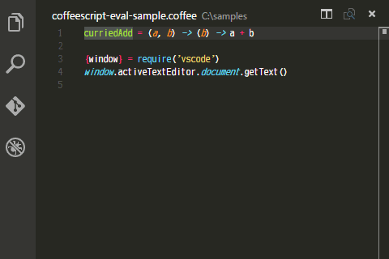

# CoffeeScript Eval
Evaluate selected CoffeeScript code.

[![Dependency Status][dependency-img]][dependency-url]
[![Build Status][build-img]][build-url]
[![GitHub license][license-img]][license-url]

## Features

* Evaluates selected CoffeeScript code.
* If evaluation result is a function, re-evaluate it with input arguments.
* Re-evaluation of functions supports curried functions.
* Evaluation in the context of Visual Studio Code.

## Usage

1. Open or create a CoffeeScript source file
1. Select code which you want to evaluate
1. Press `Ctrl(Cmd)+K Ctrl(Cmd)+E` or Execute from command palette (See below)
  1. Press `F1` or `Ctrl(Cmd)+Shift+P`
  1. Type `coe`
  1. pick `CoffeeScript Eval`

[dependency-img]: https://gemnasium.com/badges/github.com/eheitherd/vscode-coffeescript-eval.svg
[dependency-url]: https://gemnasium.com/github.com/eheitherd/vscode-coffeescript-eval
[build-img]: https://travis-ci.org/eheitherd/vscode-coffeescript-eval.svg?branch=master
[build-url]: https://travis-ci.org/eheitherd/vscode-coffeescript-eval
[license-img]: https://img.shields.io/badge/license-MIT-blue.svg
[license-url]: https://raw.githubusercontent.com/eheitherd/vscode-coffeescript-eval/master/LICENSE
